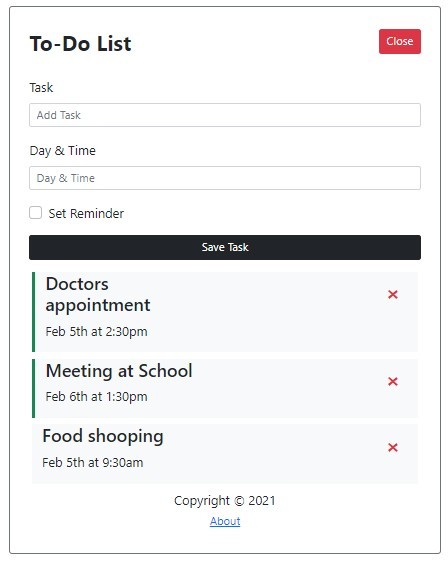

<h1 align="center">To-Do List App</h1>

## About the project



A very simple To-Do List app using ReactJS and Bootstrap5 to learn ReactJS library.

### Built With

* [React Js](https://reactjs.org)
* [Bootstrap 5](https://getbootstrap.com)

## Getting Started

### Prerequisites

Before cloning this project, you must have installed [Node.js](https://nodejs.org/en) on your machine. And preferably, use [yarn](https://yarnpkg.com/getting-started/install).

* yarn

  ```sh
  npm install -g yarn
  ```

### Installation

1. Clone the repo

   ```sh
   git clone https://github.com/angelokezimana/todo-list.git
   ```

2. Install NPM packages

   ```sh
   yarn install
   ```

3. Copy the `db-example.json` file and rename it to `db.json`

   ```sh
   cp db-example.json db.json
   ```

4. In the project, open 2 terminals; one to run `json-server` and the other to run the application

    * `json-server`

    ```sh
    yarn server
    ```

    * Run the app

    ```sh
    yarn start
    ```
